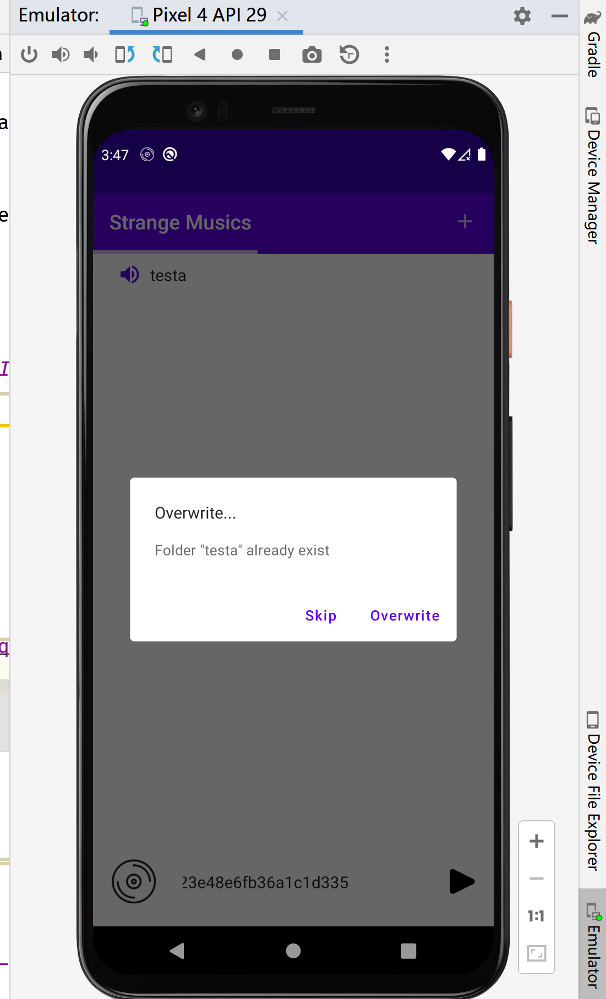
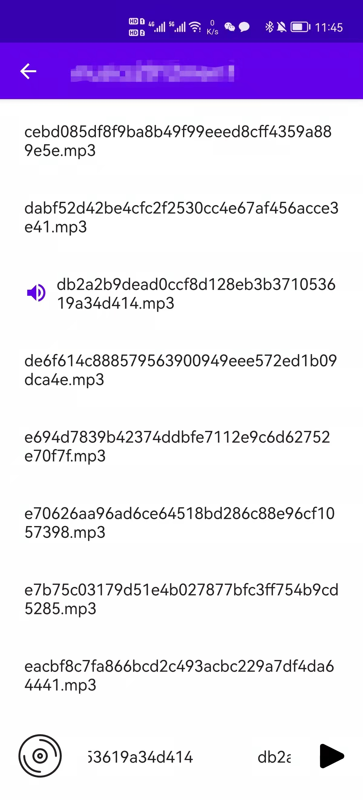
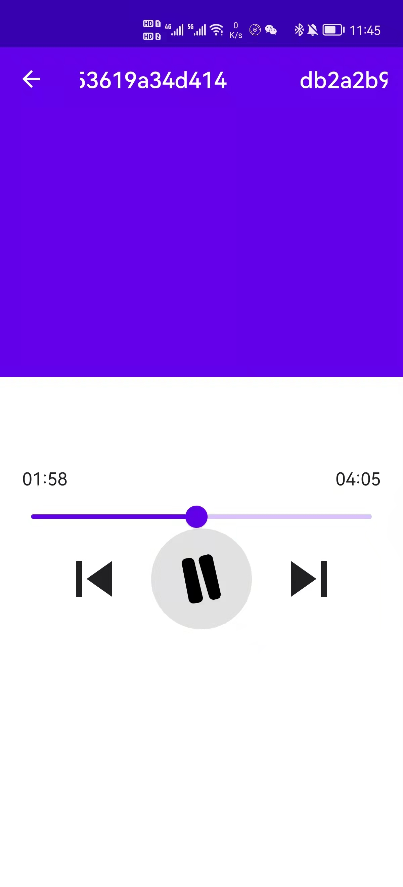
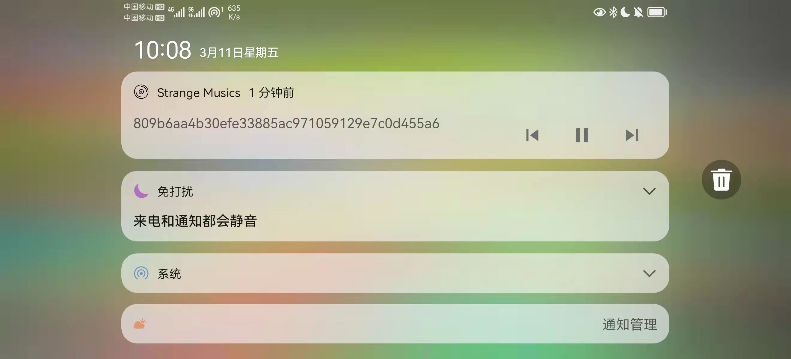

# AnotherAndroidLocalMusicPlayer
Another local music player for Android built with Compose and media3 (ExoPlayer).

## Warning
The app behaves strangly as it is highly customized for kittenal ("personal") use. It is more "local" than it looks like.
It imports musics into its container (private storage under `/data/data`) from zip files.
It also intentionally does not support `MediaSession`. It is nonsense in most cases but we somehow need it.
If you need a local music player, or if you are looking for how to implement a Android-standard local music player,
have a look at [Simple-Music-Player](https://github.com/SimpleMobileTools/Simple-Music-Player) or its like instead.

